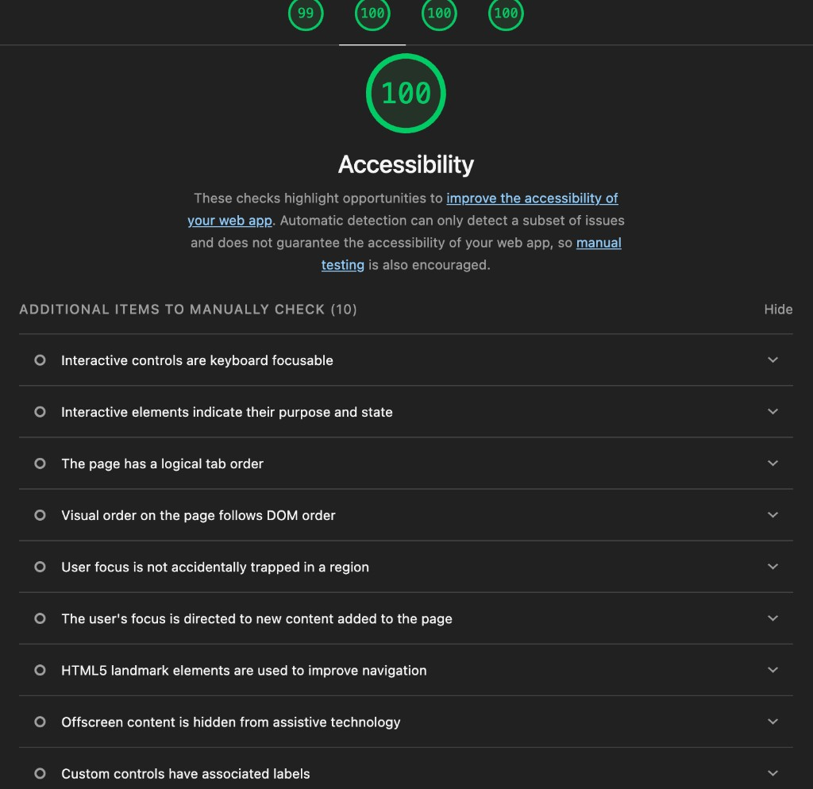
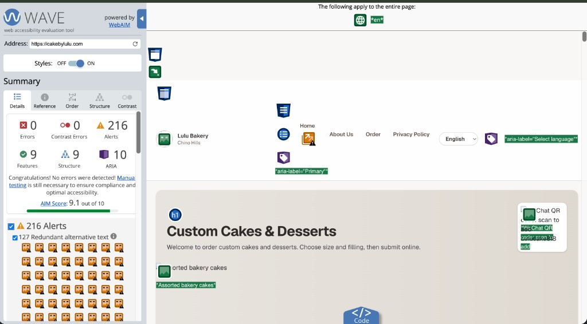

# Accessibility Report — Lulu Bakery

**Date:** 2026-09-12  
**Scope:** Public storefront pages (`/`, category routes, `/about`, `/privacy`, `/order`)  
**Standards:** WCAG 2.2 Level AA (POUR)  
**Live URL:** https://cakebylulu.com (or production Vercel domain)

---

## Tools used (minimum two)

| Tool | Result | Evidence |
|---|---|---|
| **Lighthouse (Chrome DevTools)** | **Accessibility score: 100** | `docs/audit-screenshots/lighthouse-accessibility-100.png` |
| **WAVE (WebAIM)** | **Errors: 0 · Contrast errors: 0 · AIM 9.1/10** | `docs/audit-screenshots/wave-homepage.png` |
| **axe-core (automated smoke)** | serious/critical = 0 (`npm run test:a11y`) | Vitest output |

### Lighthouse notes (2026-09-12)

- Automated Accessibility audits passed (**100**).  
- Lighthouse still lists **manual checks** (keyboard focus, tab order, landmarks, focus not trapped, etc.). Those were verified by hand against the POUR checklist below (Skip link, Tab through nav, Esc on dialog, breadcrumbs, semantic `header`/`nav`/`main`/`footer`).

### WAVE notes (2026-09-12)

- **0 Errors**, **0 Contrast Errors** on the homepage.  
- AIM score **9.1 / 10**.  
- **Alerts (not errors):**
  - *Nearby image has the same alternative text* — product cards previously reused identical alts. Fixed: each photo uses a unique descriptive `alt` (`category + title + short id`).  
  - *Redundant link* — logo and **Home** both pointed to `/`. Fixed: remove **Home** from the nav; the brand logo remains the home control.  
  - Note: WAVE may still warn that nearby title text is similar to `alt` (advisory). Prefer descriptive alts over empty `alt` per product requirement.
- Re-run WAVE after deploy; alert counts should drop sharply. Errors/contrast should stay at 0.

---

## Manual POUR checklist

### Perceivable
- [x] Meaningful text alternatives on product/hero images  
- [x] Text contrast tokens documented (`#2F2926` / `#5C4B43` on cream)  
- [x] Content readable when CSS print stylesheet applied  
- [x] Language selector present (zh / en / es)

### Operable
- [x] Skip link to `#main-content`  
- [x] Full keyboard access to nav, tabs, search, form, modal  
- [x] Visible focus styles (`:focus-visible`)  
- [x] Modal closes with Escape; focus moves to close control  
- [x] No keyboard traps in primary flows

### Understandable
- [x] Consistent sticky primary navigation across pages  
- [x] Breadcrumbs on deeper routes (`/about`, `/privacy`, `/sweet/photos`)  
- [x] Form labels associated; validation messages in plain language  
- [x] Readable link text (not “click here”)

### Robust
- [x] Semantic landmarks: `header`, `nav`, `main`, `article`, `footer` (`SiteFooter`)  
- [x] ARIA for tabs (`role="tablist"`), dialog (`role="dialog"`), search region  
- [x] Valid HTML5 controls (`type="email|date|time|search"`)
- [x] Breadcrumbs on category routes, `/sweet/photos`, `/order`, `/about`, `/privacy`

---

## Issues found & fixed (examples)

| # | Issue | Fix |
|---|---|---|
| 1 | No skip link / weak landmark focus target | Added `SkipLink` + `id="main-content"` |
| 2 | Header links not in `<nav>`; image-only cards | Shared `SiteHeader`; card titles from `descriptionI18n` |
| 3 | Success overlay not announced as dialog | `role="dialog"`, `aria-modal`, labelled title/description, Esc |
| 4 | Active nav pill text low contrast after `:visited` | Forced white text on active brand pills |
| 5 | WAVE: redundant / duplicate product image alts | Unique descriptive `alt` per cake (`category + title + id`); button still has `aria-label` |
| 6 | WAVE: redundant Home + logo links to `/` | Keep logo as home; drop duplicate Home nav item |

---

## Known limitations

- Admin UI (`/admin`) is out of public a11y scope for this course deliverable.  
- Language switch updates copy client-side; document `lang` remains `en` unless extended.  
- Full focus trap (Tab cycling only inside modal) is partial — Esc + initial focus implemented.

---

## Remediation plan (if audits still flag items)

1. Re-run WAVE after deploy to confirm redundant-alt alerts drop.  
2. Add `html[lang]` sync when language changes (enhancement).  
3. Expand axe coverage to full page renders with Next test harness if required by instructor.
